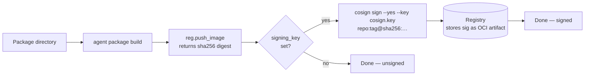

# Cosign Signing of OCI Images at Build Time

## Overview

After `vynil build`, the agent pushes the OCI image to the registry then **signs it with
Cosign** if a signing key is provided. Harbor (and any Cosign-compliant registry) then
verifies that the images present a valid signature before allowing them into production.

Signing is **optional by design**: without a configured key, the build proceeds normally
and the image is pushed unsigned. This ensures compatibility with environments that have
not yet deployed Cosign.

---

## Execution flow



Signing happens **after the push**, in line with the standard Cosign workflow:
signatures are stored as OCI artifacts in the same registry
(tag `sha256-<digest>.sig`), which requires the image to already be present.

---

## CLI parameter

```
--signing-key <SIGNING_KEY>   [env: SIGNING_KEY]   [default: ""]
-k <SIGNING_KEY>
```

| Value | Behavior |
|--------|-------------|
| *(empty)* | Signing silently ignored — the build succeeds without signing |
| `/path/to/cosign.key` | `cosign sign --yes --key /path/to/cosign.key <ref>@<digest>` |

---

## Prerequisites

- The `cosign` binary must be present in the agent's `PATH` at build time.
- The Cosign private key (`cosign.key`) must be accessible by the agent process.
  In a Kubernetes environment, mount it via a Secret:

```yaml
volumes:
  - name: cosign-key
    secret:
      secretName: cosign-signing-key
containers:
  - name: agent
    volumeMounts:
      - name: cosign-key
        mountPath: /etc/cosign
        readOnly: true
    env:
      - name: SIGNING_KEY
        value: /etc/cosign/cosign.key
```

---

## Generating a Cosign key pair

```bash
cosign generate-key-pair
# Produces: cosign.key (private) and cosign.pub (public)
```

Store `cosign.key` in a Kubernetes Secret and distribute `cosign.pub` to admission
policies (e.g. Kyverno, Sigstore Policy Controller) for in-cluster verification.

---

## Verifying a signed image

```bash
cosign verify \
  --key cosign.pub \
  registry.example.com/category/my-package:1.2.3
```

---

## Error behavior

| Situation | Result |
|-----------|---------|
| `cosign` not in PATH | `Stdio` error — the build fails |
| Key not found or invalid | `cosign sign` returns a non-zero exit code — the build fails |
| Registry unreachable for signing | `cosign sign` fails — the build fails |
| Empty key (`""`) | Signing silently ignored — the build succeeds |

---

## Technical implementation

- `common/src/ocihandler.rs` — `Registry::push_image` now returns the digest
  (`sha256:<hex>`) instead of `()`; `Registry::sign_image` invokes `cosign sign` via
  `std::process::Command`.
- `agent/scripts/packages/build.rhai` — captures the digest returned by `push_image` and
  calls `sign_image` if `args.signing_key` is defined.
- `agent/src/package/build.rs` — `--signing-key` / `SIGNING_KEY` parameter added.
