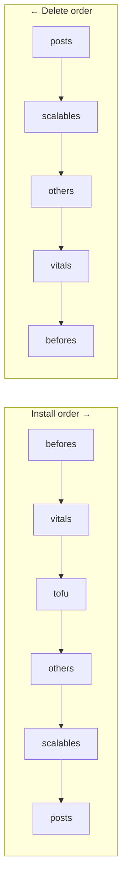

# Concepts

This page establishes the vocabulary and mental model of Vynil. Everything else in
the documentation builds on it.

## Package

A **Vynil package** is an **OCI image** published in a registry. It contains:

- **metadata** carried by OCI annotations (name, category, type, features,
  prerequisites, options, recommendations, `value_script`);
- **content**: Handlebars templates (`*.yaml.hbs`), static YAML manifests,
  and Rhai scripts describing the lifecycle (`scripts/`).

On the development side, a package is a **directory** with a `package.yaml` (see
[Package format](packages/format.md)) that you **build** (`agent package build`) into
an OCI image.

### Package type (`type`)

The type fixes the scope and capabilities. It is exposed as `usage` in the code.

| Type | Purpose | Backup | Own CRDs |
|---|---|---|---|
| `system` | cluster component (CNI, ingress, operator…) | no | yes (`get_crds/`) |
| `service` | application shared at cluster scale | yes | yes |
| `tenant` | application scoped to the namespace/tenant | yes | no |

The type also determines which CRD drives the installation (`SystemInstance` /
`ServiceInstance` / `TenantInstance`) and which set of agent scripts is used
(`agent/scripts/{system,service,tenant}/`).

> ⚠️ The `type` of a package can change between two publications (e.g. a package
> historically published as `tenant` republished as `service`). This is a real-world
> case that impacts uninstallation — see [Troubleshooting](operations/troubleshooting.md).
> It is however strongly discouraged: this is an edge case that may arise during
> maturation or development of a package. If a type change is unavoidable, treat it
> as a migration and ensure that the last revision of the old type remains available
> in the registry — see
> [Registry maintenance](jukebox/registry-maintenance.md).

### Category (`category`)

A free-form string grouping packages together (e.g. `core`, `networking`, `database`,
`think`). The **`category/name`** pair identifies a package within a JukeBox.

### Features

Declarative flags: `upgrade`, `backup`, `monitoring`, `high_availability`,
`auto_config`, `auto_scaling`, `deprecated`. They describe what the package is
capable of.

## JukeBox — the package source

A `JukeBox` (cluster-scoped) describes **where** packages come from and **when** to
rescan them. The scan (an agent Job driven by a CronJob) lists available versions,
filters by semver/maturity/compatibility, computes **upgrade waypoints**, then writes
the catalogue into `JukeBox.status.packages`. This cache is what the operator
consults for every installation.

Possible sources: OCI list, Harbor project, GitLab project, Rhai script, HTTP cache,
or S3 bucket. See [JukeBox sources](jukebox/sources.md).

### Maturity and waypoints

A JukeBox has a `maturity` (`stable` | `beta` | `alpha`). The scan does not keep all
versions: it retains **one waypoint per "epoch"** of `MinimumPreviousVersion`, which
enables progressive updates (upgrade chain) without storing the full history.

Example — published versions `[4.0(min:3.0), 3.5(min:2.0), 3.0(min:2.0), 2.5, 1.5]`
→ retained waypoints `[4.0, 3.5, 2.5, 1.5]`.

## Instance — an installation

An **instance** is a request to install a package in a namespace. The three CRDs
share the same mechanics (`spec.jukebox`, `spec.category`, `spec.package`,
`spec.options`) and a `status` that records the installed version (`status.tag`),
the options fingerprint (`status.digest`), conditions, and — for service/tenant — the
**children** created (see below).

```yaml
apiVersion: vynil.solidite.fr/v1
kind: TenantInstance
metadata:
  name: gretel
  namespace: epikaf-nan-ia
spec:
  jukebox: home-alpha
  category: think
  package: ollama
  options:
    use_rocm: true
    models: [ "qwen3:14b", "mistral-small3.2:24b" ]
```

### Children and phases

At installation time, the agent applies the package objects in **ordered phases** and
records the created objects in the instance `status` by category:



| Phase / status field | Typical content | Install order | Delete order |
|---|---|---|---|
| `befores` | prerequisites (init jobs, secrets) | 1 | last |
| `vitals` | persistent data (PVC) | 2 | second-to-last |
| *(tofu)* | OpenTofu/Terraform resources | 3 | — |
| `others` | Service, ConfigMap, Ingress, Role… | 4 | 3rd |
| `scalables` | Deployment, StatefulSet… | 5 | 1st (with tofu) |
| `posts` | final actions | 6 | first |

The agent fetches the up-to-date instance between each phase. **Uninstallation**
proceeds in reverse order and relies on these `status` lists to know *what* to
delete. The `status` alone is not sufficient however: the **delete hooks** embedded
in the package image remain essential for cleaning up resources created
*indirectly* (for example volumes created by a third-party operator that do not carry
the instance ownership markers). See
[Package lifecycle](packages/lifecycle.md).

> The presence of at least one child (`status.have_child()`) signals that an instance
> has actually deployed something; cleanup logic takes this into account.

### initFrom — restore

`spec.initFrom` (service/tenant) allows initialising a new installation from a
backup (Restic snapshot), optionally specifying a precise package `version` to use
for the restore.

## Agent vs Operator

- The **operator** (`operator`) watches the CRDs and decides *what* to do: it selects
  the package from the JukeBox cache, checks prerequisites, renders the Job template,
  and creates/deletes that Job. It never touches application objects directly.
- The **agent** (`agent`, launched in a Job) does the concrete work: it unpacks the
  OCI image, executes the package's Rhai scripts, renders the Handlebars templates,
  and applies the objects in the cluster.

This separation is the key to the architecture: see [Architecture](architecture.md)
and [Reconciliation](reconciliation.md).

## Rhai scripts and Handlebars templates

- **Handlebars** renders Kubernetes manifests from the instance context
  (helpers `image_from_ctx`, `resources_from_ctx`, `selector_from_ctx`…).
- **Rhai** is the lifecycle scripting language. The engine exposes functions for K8s,
  OCI, HTTP, S3, secrets, passwords, semver manipulation, etc. Some primitives (shell,
  file access, environment variables) are powerful and must be considered in the
  [threat model](operations/security.md).
