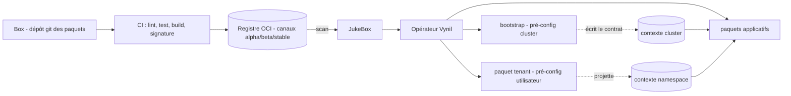
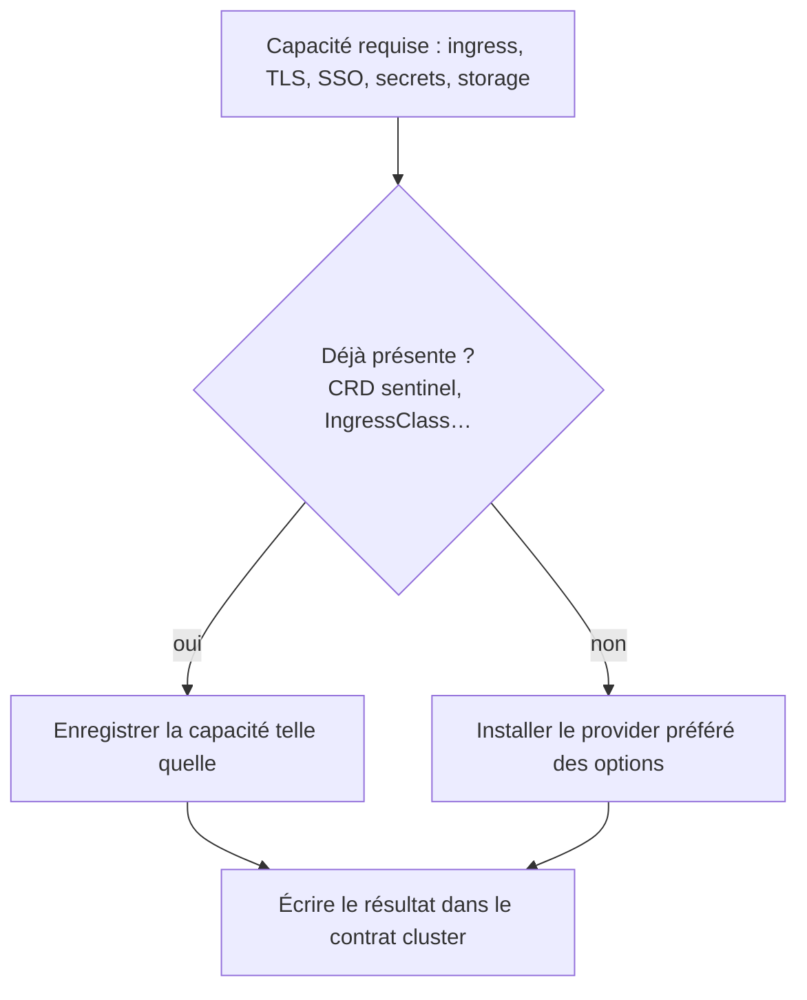
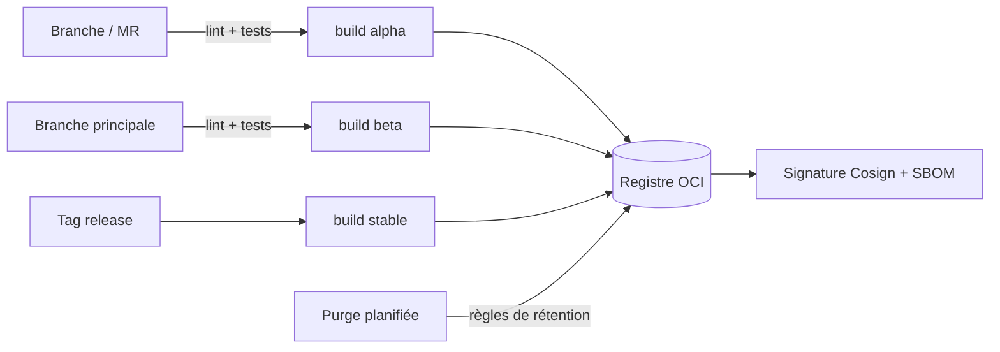

# Construire une distribution Vynil

Une **distribution Vynil** n'est pas un tas de paquets : c'est un ensemble d'opinions
matérialisées — une box (le dépôt des paquets), des conventions, une CI, et deux paquets
fondateurs qui pré-configurent le cluster puis l'espace utilisateur. Cette page décrit le
processus de création d'une distribution et les décisions qui la structurent.

> Ironie assumée : Vynil sert à construire des systèmes opiniâtres, mais choisit de ne pas
> l'être lui-même pour ne fermer aucun cas d'usage. Il fournit les structures de *votre*
> opinion.

## La valeur ajoutée : l'opiniâtreté

Un artefact du marché (chart Helm, kustomization) est par définition **non-opiniâtre** : il
doit répondre au plus grand nombre, donc il expose des centaines d'options, laisse les
choix de sécurité « à la responsabilité de l'utilisateur », et ne s'intègre à rien. Le
résultat connu : des semaines de configuration, et des trous laissés ouverts en amont.

Empaqueter pour Vynil, c'est l'inverse : **prendre ce qui existe sur le marché et le
standardiser dans le cadre de la distribution**. Le tooling (génération, lint, tests)
automatise la mécanique ; le vrai travail est la prise de décision :

- les **ressources** des pods (requests/limits réalistes, pas de valeurs par défaut creuses) ;
- les **HPA** requis — ou leur absence assumée ;
- la **classe de stockage** adaptée à chaque besoin (données répliquées ou non, RWX/RWO) ;
- les **flux réseau** nécessaires, donc les `NetworkPolicy` ;
- **opérateur dédié ou paquet Vynil** ? (guide de décision ci-dessous) ;
- la **politique de sécurité** applicable (PSS, seccomp, capabilities) ;
- les **prérequis et dépendances** (`requirements`) ;
- les **événements cluster qui doivent déclencher une reconfiguration** d'une instance
  (`recommandations` : apparition d'un CRD, d'un service système…) ;
- ce que le paquet **apporte aux autres** pour leur auto-configuration (services/capacités
  publiés).

Le résultat pour l'utilisateur final : une installation simple, des options peu nombreuses
et **compréhensibles par un non-spécialiste**, et une intégration automatique à son
écosystème (SSO détecté et configuré, certificats émis, sauvegardes branchées…).

## Guide de décision : opérateur dédié ou paquet ?

| Question | Si oui | Si non |
|---|---|---|
| Le contrôleur fait-il plus que déployer des ressources (failover, réplication de données, orchestration d'état) ? | Installer l'opérateur (paquet `system`) et consommer ses CRs depuis les paquets applicatifs | Un paquet Vynil suffit |
| L'application gère-t-elle plusieurs instances avec des cycles de vie indépendants pilotés par l'opérateur ? | Opérateur | Paquet |
| Le « pattern » de l'opérateur se limite-t-il à templater des manifestes ? | — | Paquet : Vynil fait déjà ce travail, l'opérateur serait un poids mort |

Beaucoup d'opérateurs du marché relèvent du dernier cas : dans un contexte Vynil, ils
n'apportent rien.

## Anatomie d'une distribution

Une distribution comporte typiquement :

1. **la box** : un dépôt `<catégorie>/<paquet>/`, avec ses conventions (nommage,
   namespaces, sécurité) ;
2. **un paquet `bootstrap`** (système) — pré-configuration du *cluster* ;
3. **un paquet `tenant`** (système) — pré-configuration de l'*espace utilisateur* ;
4. **une CI** qui lint, teste, construit, signe et publie ;
5. **un ou plusieurs registres** et les JukeBox de maturité correspondantes.

## Bootstrap — pré-configurer le cluster

Le bootstrap est le point d'entrée de la plateforme. Il a deux responsabilités séquencées :

1. **Aligner le cluster** : détecter ce qui existe, installer ce qui manque pour atteindre
   le niveau de capacité voulu ;
2. **Écrire le contrat** : publier dans la configuration cluster de Vynil les scripts de
   contexte et les valeurs résolues, pour que tout paquet installé ensuite dispose d'une
   vision complète et cohérente du cluster **sans interroger l'API lui-même**.

Sa philosophie : **detect → gap-fill → write**. Les options du bootstrap ne sont pas des
feature flags (« voulez-vous un ingress ? ») mais des **préférences d'installation**
(« si le cluster n'a pas d'ingress, lequel installer ? ») :

Ce modèle permet à une même box d'atterrir sur des clusters de profils très différents
(mono-nœud de dev, cloud managé avec ingress/IdP fournis, baremetal complet, OpenShift) :
le bootstrap ne cible pas un profil, il s'adapte à celui qu'il trouve.

## Tenant — pré-configurer l'espace utilisateur

Pour Vynil, la définition native d'un tenant est **volontairement minimale** : un ensemble
de namespaces partageant un couple clé/valeur de labels. Rien de plus — et cette
définition ne peut pas être réduite, car chaque distribution l'étend dans sa propre
direction.

Une distribution doit donc **compléter** cette définition par un paquet de type `system`
qui orchestre réellement le cycle de vie d'un tenant. Ce paquet matérialise ce qu'« être
un tenant » signifie dans la distribution, typiquement :

- un **namespace système** du tenant, portant ses briques de base (SSO dédié, gestionnaire
  de secrets dédié…) ;
- la **frontière d'isolation** : RBAC, quotas natifs, périmètre réseau (une posture
  par défaut extensible localement, plutôt qu'un deny-all rigide) ;
- des **conventions** (sauvegarde, mail…) dont les secrets sont sourcés depuis le
  gestionnaire de secrets du tenant — jamais d'identifiants en clair dans les options ;
- la **projection du contexte** : les valeurs résolues (SSO, secrets, conventions) sont
  exposées dans le contexte de namespace, avec une cascade de priorité du type
  `annotation du namespace > configuration du tenant > défaut cluster`.

Bootstrap et tenant forment les deux moitiés du même contrat :

| | Bootstrap | Paquet tenant |
|---|---|---|
| Pré-configure | le **cluster** | l'**espace utilisateur** |
| Écrit | le contexte cluster (`context.cluster`) | le contexte namespace (`context.namespace`) |
| Un paquet applicatif… | ne sonde jamais le cluster | ne sonde jamais le tenant |

C'est ce qui rend les installations applicatives triviales : le paquet **lit** des valeurs
déjà résolues au lieu de poser des questions à l'utilisateur ou de fouiller l'API.

## Customiser Vynil au niveau cluster

Le comportement de Vynil est extensible au niveau du cluster : scripts de contexte,
valeurs de configuration de l'agent, définition du label de tenant. C'est par ce canal
qu'une distribution injecte ses opinions transverses — et qu'elle alimente
l'auto-configuration de tous les paquets. Tout ce que le bootstrap « écrit » est lu ici.

## Utilisateurs finaux et objets cluster-wide

Un utilisateur de tenant n'a pas — et ne doit pas avoir — les droits sur les objets
cluster-wide (namespaces, CRDs, classes). Stratégies éprouvées pour lui donner néanmoins
la main, sans élévation de droits :

- **objets namespacés comme surface de demande** : l'utilisateur exprime son besoin via un
  objet dans son namespace (une instance, une annotation) ; un paquet `system` de la
  distribution réconcilie et matérialise la partie cluster-wide ;
- **annotations à cascade** : une annotation posée sur le namespace surcharge la
  configuration du tenant, elle-même surchargée du défaut cluster — détectée par les
  `value_script`/scripts de contexte ;
- **ponts d'API déclaratifs** : pour les systèmes qui n'exposent qu'une API REST
  (provisionnement de royaumes SSO, de clients OIDC…), un opérateur de pont REST permet de
  déclarer ces appels comme des objets namespacés ;
- **self-service par instances** : la `TenantInstance` est elle-même la surface de
  self-service — l'utilisateur (ou le produit SaaS au-dessus) crée des instances, la
  distribution garde le contrôle de ce qu'elles peuvent faire.

## Un projet open-source peut publier sa propre box

Rien ne réserve la création de box aux opérateurs de clusters : un **projet open-source
peut publier directement ses paquets Vynil**, comme il publie un chart Helm — la box
devient le « packaging officiel amont ». Les utilisateurs ajoutent une JukeBox pointant
vers le registre du projet et obtiennent une installation intégrée, signée et maintenue
par l'amont.

C'est le modèle des distributions Linux porté à Kubernetes : l'amont fournit le paquet, la
distribution l'intègre — et un même cluster peut consommer plusieurs box (celle de la
distribution, celle d'un projet amont) via plusieurs JukeBox.

## La CI d'une distribution

Les invariants d'une CI de distribution saine :

1. **lint et tests bloquants** avant tout build (`agent package lint` / `agent package test`) ;
2. **canaux de maturité** : les branches de travail publient en `alpha`, la branche
   principale en `beta`, les tags en `stable` — les JukeBox filtrent par `maturity` ;
3. **signature et SBOM** au build ([Build & signature](build-signing.md)) ;
4. **purge planifiée** du registre, respectant les règles de rétention
   ([Maintenance du registre](jukebox/registry-maintenance.md)) ;
5. les mises à jour amont passent par `agent package update` + relecture, jamais par
   modification directe des manifestes générés.

## Étapes préparatoires — checklist

1. choisir le **registre** et les canaux de maturité, créer les JukeBox ;
2. fixer les **conventions** de la box : catégories, namespaces de déploiement, classes de
   stockage, politique de sécurité, politique réseau ;
3. écrire le **bootstrap** (detect → gap-fill → write) pour les profils de clusters visés ;
4. écrire le **paquet tenant** (la définition de *votre* tenant) ;
5. monter la **CI** (lint, tests, build signé, purge) ;
6. empaqueter les **premières applications** — et capitaliser chaque décision
   d'intégration dans les conventions de la box.
