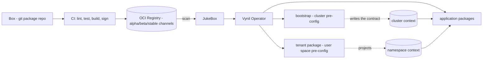
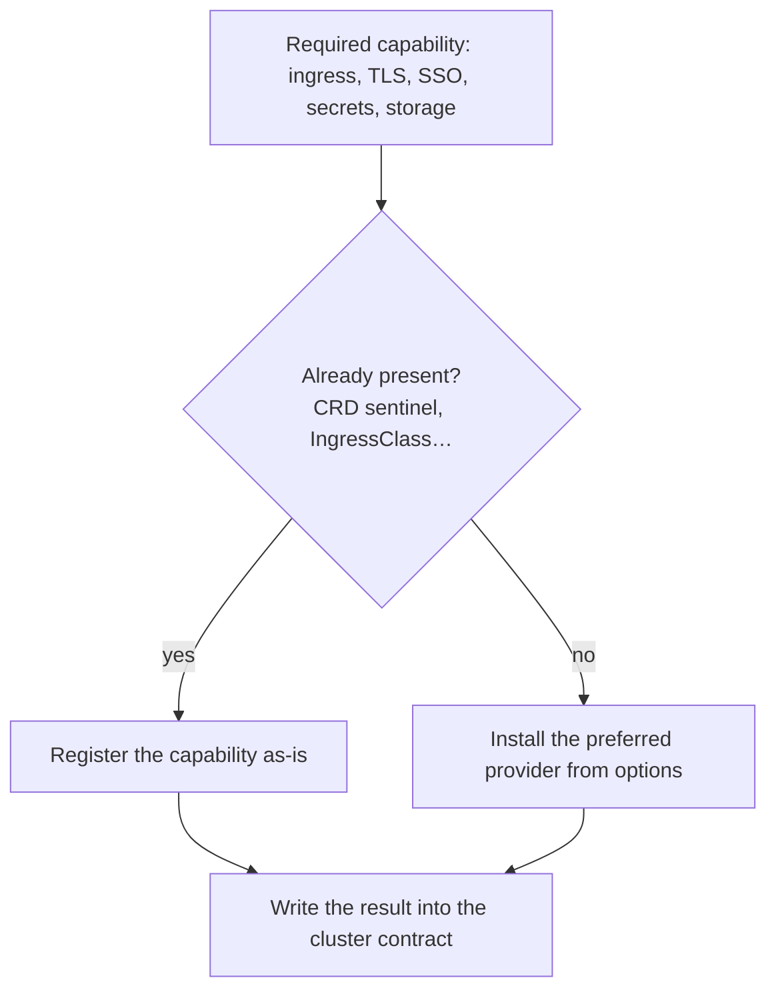
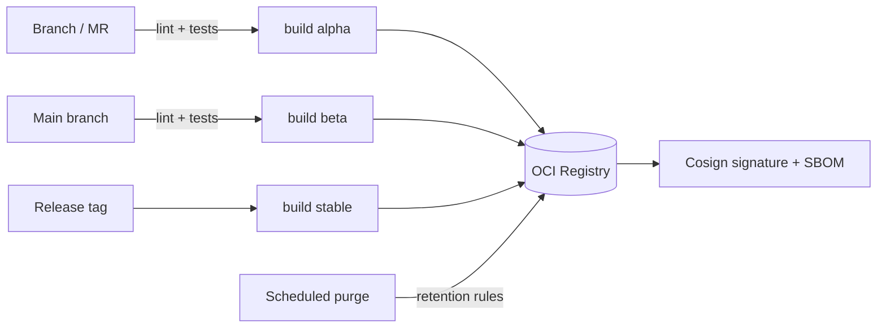

# Building a Vynil distribution

A **Vynil distribution** is not a pile of packages: it is a set of materialised
opinions — a box (the package repository), conventions, a CI pipeline, and two
founding packages that pre-configure the cluster and then the user space. This page
describes the process of creating a distribution and the decisions that shape it.

> Acknowledged irony: Vynil is designed to build opinionated systems, yet deliberately
> chooses not to be opinionated itself so as not to close off any use case. It
> provides the structures for *your* opinions.

## The value proposition: opinionation

A market artefact (Helm chart, kustomization) is by definition **unopinionated**: it
must serve the largest possible audience, so it exposes hundreds of options, leaves
security choices "at the user's responsibility", and integrates with nothing. The
well-known result: weeks of configuration, and gaps left open upstream.

Packaging for Vynil is the opposite: **taking what exists on the market and
standardising it within the distribution's framework**. The tooling (generation, lint,
tests) automates the mechanics; the real work is decision-making:

- pod **resources** (realistic requests/limits, not hollow defaults);
- required **HPAs** — or their deliberate absence;
- the **storage class** suited to each need (replicated or not, RWX/RWO);
- the necessary **network flows**, hence the `NetworkPolicy` objects;
- **dedicated operator or Vynil package**? (decision guide below);
- the applicable **security policy** (PSS, seccomp, capabilities);
- **prerequisites and dependencies** (`requirements`);
- the **cluster events that should trigger reconfiguration** of an instance
  (`recommendations`: appearance of a CRD, a system service…);
- what the package **provides to others** for their auto-configuration (published
  services/capabilities).

The result for the end user: a simple installation, few options that are
**understandable by a non-specialist**, and automatic integration into their ecosystem
(SSO detected and configured, certificates issued, backups wired up…).

## Decision guide: dedicated operator or package?

| Question | If yes | If no |
|---|---|---|
| Does the controller do more than deploying resources (failover, data replication, state orchestration)? | Install the operator (a `system` package) and consume its CRs from application packages | A Vynil package is sufficient |
| Does the application manage multiple instances with independent lifecycles driven by the operator? | Operator | Package |
| Does the operator "pattern" amount to nothing more than templating manifests? | — | Package: Vynil already does this work, the operator would be dead weight |

Many market operators fall into the last category: in a Vynil context, they add
nothing.

## Distribution anatomy

A distribution typically comprises:

1. **the box**: a `<category>/<package>/` repository, with its conventions (naming,
   namespaces, security);
2. **a `bootstrap` package** (system) — *cluster* pre-configuration;
3. **a `tenant` package** (system) — *user space* pre-configuration;
4. **a CI pipeline** that lints, tests, builds, signs, and publishes;
5. **one or more registries** and the corresponding maturity JukeBoxes.

## Bootstrap — pre-configuring the cluster

The bootstrap is the platform's entry point. It has two sequenced responsibilities:

1. **Align the cluster**: detect what exists, install what is missing to reach the
   desired capability level;
2. **Write the contract**: publish into Vynil's cluster configuration the context
   scripts and resolved values, so that any package installed afterwards has a
   complete and consistent view of the cluster **without querying the API itself**.

Its philosophy: **detect → gap-fill → write**. Bootstrap options are not feature
flags ("do you want an ingress?") but **installation preferences** ("if the cluster
has no ingress, which one should be installed?"):

This model allows the same box to land on clusters with very different profiles
(single-node dev, managed cloud with ingress/IdP provided, full baremetal, OpenShift):
the bootstrap does not target a profile, it adapts to the one it finds.

## Tenant — pre-configuring the user space

For Vynil, the native definition of a tenant is **deliberately minimal**: a set of
namespaces sharing a key/value label pair. Nothing more — and this definition cannot
be reduced, since every distribution extends it in its own direction.

A distribution must therefore **complete** this definition with a `system` type
package that actually orchestrates the tenant lifecycle. This package materialises
what "being a tenant" means in the distribution, typically:

- a **tenant system namespace** carrying its base building blocks (dedicated SSO,
  dedicated secrets manager…);
- the **isolation boundary**: RBAC, native quotas, network perimeter (a locally
  extensible default posture rather than a rigid deny-all);
- **conventions** (backup, mail…) whose secrets are sourced from the tenant's secrets
  manager — never plaintext credentials in options;
- **context projection**: resolved values (SSO, secrets, conventions) are exposed in
  the namespace context, with a priority cascade of the form
  `namespace annotation > tenant configuration > cluster default`.

Bootstrap and tenant together form the two halves of the same contract:

| | Bootstrap | Tenant package |
|---|---|---|
| Pre-configures | the **cluster** | the **user space** |
| Writes | the cluster context (`context.cluster`) | the namespace context (`context.namespace`) |
| An application package… | never probes the cluster | never probes the tenant |

This is what makes application installations trivial: the package **reads** already-resolved
values instead of asking questions to the user or browsing the API.

## Customizing Vynil at the cluster level

Vynil's behaviour is extensible at the cluster level: context scripts, agent
configuration values, tenant label definition. This is the channel through which a
distribution injects its cross-cutting opinions — and feeds the auto-configuration of
all packages. Everything the bootstrap "writes" is read here.

## End users and cluster-wide objects

A tenant user does not — and must not — have rights over cluster-wide objects
(namespaces, CRDs, classes). Proven strategies for giving them control nonetheless,
without privilege escalation:

- **namespaced objects as request surface**: the user expresses their need via an
  object in their namespace (an instance, an annotation); a `system` package in the
  distribution reconciles and materialises the cluster-wide part;
- **cascading annotations**: an annotation placed on the namespace overrides the
  tenant configuration, which itself overrides the cluster default — detected by the
  `value_script`/context scripts;
- **declarative API bridges**: for systems that only expose a REST API (SSO realm
  provisioning, OIDC client creation…), a REST bridge operator allows declaring
  these calls as namespaced objects;
- **self-service via instances**: the `TenantInstance` is itself the self-service
  surface — the user (or the SaaS product above) creates instances, and the
  distribution retains control over what they can do.

## An open-source project can publish its own box

Nothing restricts box creation to cluster operators: an **open-source project can
publish its Vynil packages directly**, just as it publishes a Helm chart — the box
becomes the "official upstream packaging". Users add a JukeBox pointing to the
project's registry and obtain an integrated, signed, upstream-maintained installation.

This is the Linux distribution model brought to Kubernetes: upstream provides the
package, the distribution integrates it — and a single cluster can consume multiple
boxes (the distribution's own, an upstream project's) via multiple JukeBoxes.

## Distribution CI

The invariants of a healthy distribution CI:

1. **blocking lint and tests** before any build (`agent package lint` / `agent package test`);
2. **maturity channels**: working branches publish to `alpha`, the main branch to
   `beta`, tags to `stable` — JukeBoxes filter by `maturity`;
3. **signature and SBOM** at build time ([Build & signing](build-signing.md));
4. **scheduled purge** of the registry, respecting retention rules
   ([Registry maintenance](jukebox/registry-maintenance.md));
5. upstream updates go through `agent package update` + review, never through direct
   modification of generated manifests.

## Preparatory steps — checklist

1. choose the **registry** and maturity channels, create the JukeBoxes;
2. fix the box **conventions**: categories, deployment namespaces, storage classes,
   security policy, network policy;
3. write the **bootstrap** (detect → gap-fill → write) for the targeted cluster profiles;
4. write the **tenant package** (the definition of *your* tenant);
5. set up the **CI** (lint, tests, signed build, purge);
6. package the **first applications** — and capitalise each integration decision into
   the box conventions.
