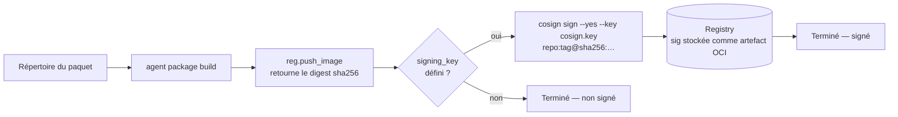

# Signature Cosign des images OCI lors du build

## Vue d'ensemble

Après `vynil build`, l'agent pousse l'image OCI vers le registry puis la **signe avec Cosign**
si une clé de signature est fournie. Harbor (et tout registry conforme Cosign) vérifie ensuite
que les images présentent une signature valide avant de les autoriser en production.

La signature est **optionnelle par conception** : sans clé configurée, le build se déroule
normalement et l'image est poussée non signée. Cela garantit la compatibilité avec les
environnements qui ne déploient pas encore Cosign.

---

## Flux d'exécution



La signature se fait **après le push**, conformément au workflow standard Cosign :
les signatures sont stockées en tant qu'artefacts OCI dans le même registry
(tag `sha256-<digest>.sig`), ce qui nécessite que l'image soit déjà présente.

---

## Paramètre CLI

```
--signing-key <SIGNING_KEY>   [env: SIGNING_KEY]   [default: ""]
-k <SIGNING_KEY>
```

| Valeur | Comportement |
|--------|-------------|
| *(vide)* | Signing ignoré silencieusement — le build réussit sans signer |
| `/path/to/cosign.key` | `cosign sign --yes --key /path/to/cosign.key <ref>@<digest>` |

---

## Prérequis

- Le binaire `cosign` doit être présent dans le `PATH` de l'agent au moment du build.
- La clé privée Cosign (`cosign.key`) doit être accessible par le processus agent.
  En environnement Kubernetes, la monter via un Secret :

```yaml
volumes:
  - name: cosign-key
    secret:
      secretName: cosign-signing-key
containers:
  - name: agent
    volumeMounts:
      - name: cosign-key
        mountPath: /etc/cosign
        readOnly: true
    env:
      - name: SIGNING_KEY
        value: /etc/cosign/cosign.key
```

---

## Générer une paire de clés Cosign

```bash
cosign generate-key-pair
# Produit: cosign.key (privée) et cosign.pub (publique)
```

Stocker `cosign.key` dans un Secret Kubernetes et distribuer `cosign.pub` aux politiques
d'admission (ex: Kyverno, Sigstore Policy Controller) pour la vérification en cluster.

---

## Vérification d'une image signée

```bash
cosign verify \
  --key cosign.pub \
  registry.example.com/category/my-package:1.2.3
```

---

## Comportement en cas d'erreur

| Situation | Résultat |
|-----------|---------|
| `cosign` absent du PATH | Erreur `Stdio` — le build échoue |
| Clé introuvable ou invalide | `cosign sign` retourne un code non-zéro — le build échoue |
| Registry inaccessible pour la signature | `cosign sign` échoue — le build échoue |
| Clé vide (`""`) | Signing silencieusement ignoré — le build réussit |

---

## Implémentation technique

- `common/src/ocihandler.rs` — `Registry::push_image` retourne désormais le digest
  (`sha256:<hex>`) au lieu de `()` ; `Registry::sign_image` invoque `cosign sign` via
  `std::process::Command`.
- `agent/scripts/packages/build.rhai` — capture le digest retourné par `push_image` et
  appelle `sign_image` si `args.signing_key` est défini.
- `agent/src/package/build.rs` — paramètre `--signing-key` / `SIGNING_KEY` ajouté.
