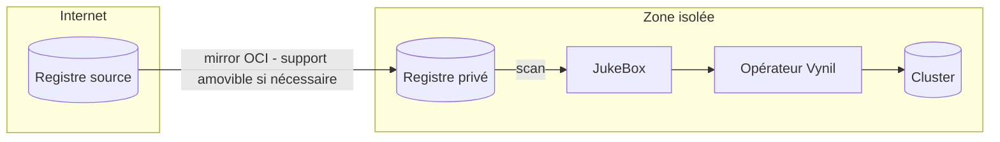

# Le paquet OCI — immutabilité, audit, air-gap

Un paquet Vynil est une **image OCI** : ce choix de format n'est pas un détail
d'implémentation, c'est ce qui rend le modèle exploitable aussi bien par une petite
structure sans équipe plateforme que par un grand compte avec ses équipes d'audit et son
PRA.

## Immutabilité

Une version publiée ne change plus : tag semver + digest de contenu. La signature Cosign
([Build & signature](../build-signing.md)) scelle ce digest — ce qui a été revu et signé
est exactement ce qui sera installé. Les politiques de mise à jour s'appuient sur des
versions immuables et des waypoints de migration explicites, pas sur un tag `latest`
mouvant.

## Auditabilité

Le contenu d'un paquet est **intégralement lisible** : `agent package unpack` restitue le
`package.yaml`, les templates Handlebars et les scripts Rhai — c'est-à-dire la recette
exacte et complète de ce qui sera appliqué au cluster. Pas de boîte noire, pas de binaire
opaque.

Conséquences pratiques :

- une équipe d'audit peut **geler une version, la relire et l'approuver** ; le digest signé
  garantit que c'est cette version-là qui tourne ;
- l'écart entre deux versions est un **diff de fichiers texte** ;
- le SBOM publié au build alimente l'analyse de vulnérabilités en continu ;
- le [modèle de menace](../operations/security.md) se résume alors à une décision de
  confiance explicite : *quelles box, signées par quelles clés ?*

## Développement sous-traitable

Le répertoire d'un paquet est un **livrable autonome** : il se développe, se lint, se teste
et se rend (`agent package test`, mocks K8s — aucun cluster requis) hors de toute
infrastructure. Son développement peut donc être confié à un tiers :

1. le prestataire livre le répertoire du paquet (ou une MR sur la box) ;
2. la revue interne lit la recette — templates et scripts, en clair ;
3. **votre** CI construit, signe et publie — la clé de signature ne quitte jamais votre
   périmètre.

La frontière de confiance est nette : le tiers écrit, vous signez.

## Air-gapped by design

Un paquet étant une image OCI standard, il se transporte avec l'outillage OCI standard
(`skopeo`, `crane`, miroirs de registres…). Un environnement isolé d'internet consomme la
distribution en miroir :

- la JukeBox scanne le registre privé — **aucune dépendance internet à l'installation** ;
- les sources `http`/`s3` ([Sources](../jukebox/sources.md)) permettent même de servir un
  index pré-calculé depuis un simple serveur de fichiers interne ;
- les signatures voyagent avec les images : la vérification reste possible hors-ligne.

## Reconstruction et PRA

Une plateforme Vynil se décrit en deux artefacts : **la box** (les paquets, dans un
registre) et **les manifestes d'instances** (JukeBox + `*Instance`, en général versionnés
en GitOps). La reconstruction après sinistre en découle :

1. restaurer/mirrorer le registre de paquets ;
2. ré-appliquer les manifestes d'instances ;
3. l'opérateur réconcilie — bootstrap, tenants, applications ;
4. restaurer les données depuis les sauvegardes (`initFrom`).

Le PRA n'est pas un document à part : c'est la distribution elle-même, rejouable et
testable.

## Pour qui ?

| | Ce que le format apporte |
|---|---|
| **Petite structure** | Des défauts opiniâtres et sûrs, zéro temps de configuration, des mises à jour par chaîne de waypoints — sans équipe plateforme dédiée. |
| **Grand compte** | Auditabilité totale du contenu, signature et SBOM pour la conformité, développement sous-traitable sans céder la signature, air-gap natif, PRA reconstructible et testable. |
