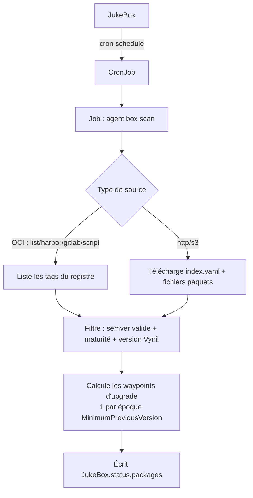
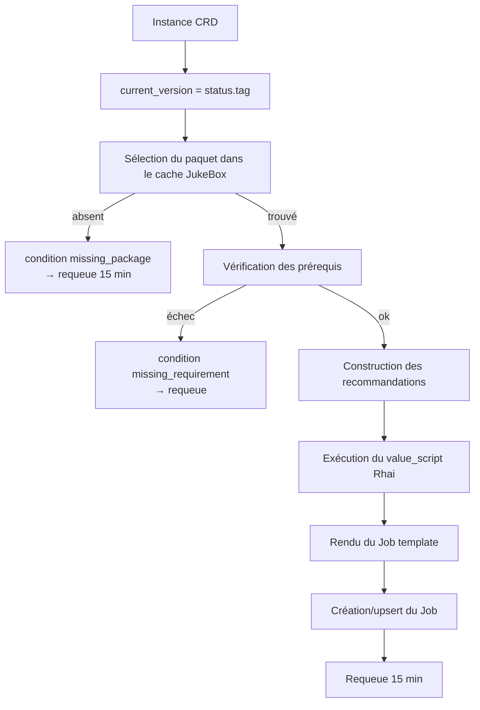
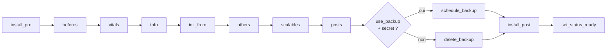
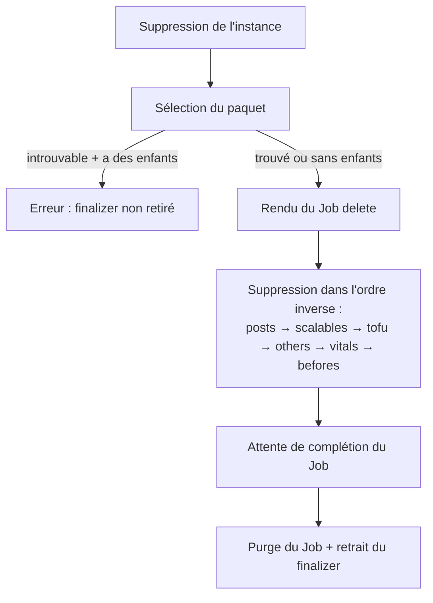

# Réconciliation & cycle de vie

Cette page décrit ce que fait l'opérateur (le « quoi ») et ce que fait l'agent (le
« comment »). Le code générique de réconciliation des instances vit dans
[`operator/src/instance_common.rs`](../../operator/src/instance_common.rs) via le trait
`InstanceKind`, partagé par les trois types d'instance.

## Scan d'une JukeBox

L'opérateur ([`operator/src/jukebox.rs`](../../operator/src/jukebox.rs)) maintient le CronJob,
détecte la complétion du Job de scan (condition `Complete`/`Failed`), et ne recharge le
cache **qu'une fois par complétion** (suivi via l'annotation `last-scan-time`).

### Scan standalone (`box file-scan`)

## Réconciliation d'une instance (apply)

`do_reconcile<T>()` :

1. `current_version = status.tag` (vide au premier install).
2. **Sélection du paquet** dans le cache de la JukeBox :
   - `name` + `category` + `usage == type de l'instance`,
   - `is_min_version_ok(current_version)` — chaîne d'upgrade respectée,
   - `is_vynil_version_ok()` — framework compatible.
   - Si absent → condition `missing_package` et requeue (15 min).
3. **Prérequis** (`check_requirements`) : CRDs, services système, ressources… Échec →
   condition `missing_requirement` et requeue.
4. **Recommandations** : listes optionnelles (CRDs présents, services système/tenant
   disponibles) injectées dans le contexte.
5. **value_script** Rhai (si présent) → variables de contrôle (`ctrl_values`).
6. **initFrom.version** (premier install) → vérification que le tag existe (cache puis OCI).
7. **Rendu du Job** via `operator/templates/package.yaml.hbs` (action `install`).
8. **Création/upsert** du Job (Server-Side Apply, fallback delete+create).
9. Requeue toutes les **15 minutes**.

L'annotation `force-reinstall` supprime le Job existant avant recréation. L'annotation
`suspend=true` court-circuite tout en (1).

## Phases d'installation (côté agent)

Une fois le Job lancé, l'agent dépaquette l'image et exécute le script de cycle de vie
(`agent/scripts/{type}/install.rhai`). Les objets sont appliqués **par phases**, et
l'instance est rechargée entre chaque phase pour propager les mises à jour de statut :

Voir [Cycle de vie d'un paquet](packages/lifecycle.md) pour le détail des hooks
`*_pre`/`*_post` et la sémantique de chaque phase.

## Désinstallation (finalizer / cleanup)

`do_cleanup<T>()` :

1. Sélection du paquet (même filtre que l'install).
2. Si le paquet est introuvable **et** que l'instance a des enfants
   (`status.have_child()`), une erreur est levée (le finalizer ne se retire pas tant que le
   paquet est introuvable).
3. Sinon : rendu du Job avec action `delete`, exécution du `delete.rhai` qui supprime les
   enfants **dans l'ordre inverse** (posts → scalables → tofu → others → vitals → befores),
   en se basant sur les listes du `status`.
4. Attente de complétion du Job de delete, purge du Job, retrait du finalizer.

> **Limites connues** (voir [Dépannage](operations/troubleshooting.md)) :
> - Si le `type` du paquet a changé depuis l'installation (ex. `tenant` → `service`), la
>   sélection échoue et la désinstallation reste bloquée (issue #12).
> - L'attente de complétion ne détecte pas l'état `Failed` : un Job de delete en échec fait
>   patienter jusqu'au timeout (issue #15).

## Gestion d'erreur et requeue

Chaque contrôleur a une `error_policy` qui logue l'erreur, incrémente les métriques
d'échec et requeue (5 min pour les JukeBox). Les réconciliations réussies requeue à 15 min.
Les opérations bloquantes (attente de suppression/complétion de Job) ont des timeouts
explicites (20 s pour une suppression, 10 min pour un Job de delete).

## Métriques

L'opérateur expose des métriques Prometheus sur `GET /metrics` (port 9000). Quatre
registres (un par type de ressource) exposent : durée des réconciliations (histogramme),
compteurs succès/échec, jauge des réconciliations en cours, horodatage du dernier
événement.
