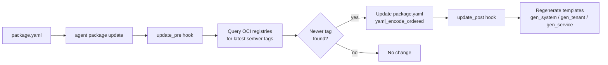

# Vynil Package Generation and Update System

## Overview

A Vynil package is a directory containing:
- `package.yaml` — manifest describing the package (metadata, images, resources, options, dependencies)
- Handlebars template subdirectories (`.yaml.hbs`) and static YAML files
- Rhai scripts (`scripts/`) for lifecycle hooks

The `gen_package.rhai` library generates these templates from a Helm render or a raw
Kubernetes manifest. The `update.rhai` script updates image tags by querying OCI
registries.

---

## `package.yaml` structure

```yaml
apiVersion: vinyl.solidite.fr/v1beta1
kind: Package
metadata:
  name: traefik             # package identifier (appslug in templates)
  category: networking      # free-form category
  type: system              # "system" | "tenant" | "service"
  app_version: "3.7.1"      # application version (semver recommended)
  description: >
    Traefik ingress controller.
  features:
    - upgrade
    - auto_config
images:
  traefik:                  # arbitrary key, referenced by {{image_from_ctx this "traefik"}}
    registry: ghcr.io
    repository: traefik/traefik
    tag: v3.7.1             # automatically updated by update.rhai
  acme-solver:
    registry: quay.io
    repository: traefik/acme-solver
    tag: v3.7.1
resources:                  # requests/limits per container, referenced by {{resources_from_ctx}}
  traefik:
    requests:
      cpu: 100m
      memory: 128Mi
    limits:
      cpu: 1000m
      memory: 256Mi
requirements: []            # list of dependencies (other packages)
options:                    # OpenAPI schema for configurable options
  replicas:
    type: integer
    default: 1
    description: Number of replicas
```

### `package.yaml` rules

- Key order is **preserved** (raw text manipulation, never re-parsed by serde_yaml which sorts alphabetically).
- Always start with `---`.
- The `images:` and `resources:` sections are overwritten at each regeneration with values extracted from the manifests.

---

## Template generation

### `placeholder()`

Generates a unique kubernetes-valid string (`v<8-hex-chars>`, e.g. `vf3a27b8c`).

**Why to use it for everything:** Helm inserts both the release name and the namespace into resource names (e.g. `traefik-vynil-apps-clusterrole`). If these values are real strings (like `"traefik"` or `"vynil-apps"`), they may appear in other contexts (image names, labels…) and cause false positives during replacement. A distinctive random string avoids this problem.

```rhai
import "gen_package" as gen;

let name = gen::placeholder();   // replaced by {{instance.appslug}} in templates
let ns   = gen::placeholder();   // replaced by {{instance.namespace}} in templates

// In Rhai, no line continuation \  —  use += for readability
let cmd  = `helm template ${name}`;
cmd     += " oci://ghcr.io/traefik/helm/traefik";
cmd     += ` --namespace=${ns}`;
cmd     += " --values values.yml 2>&1";

gen::gen_system(args.source, yaml_decode_multi(shell_output(cmd)), name, ns);
```

---

### `gen_system(path, docs[, name[, ns]])`

Generates templates for a **system package** (cluster-wide resources: CRD, ClusterRole, Deployment in a dedicated namespace).

| Parameter | Type | Description |
|-----------|------|-------------|
| `path` | `string` | Path to the package directory |
| `docs` | `array` | List of Kubernetes maps (output of `yaml_decode_multi`) |
| `name` | `string` | Helm release name. All occurrences → `{{instance.appslug}}`. Inferred from `package.yaml` if absent |
| `ns` | `string` | *(optional)* Helm namespace (`--namespace=`). All occurrences → `{{instance.namespace}}` |

**Created directories:**
- `get_crds/` — CustomResourceDefinitions (static `.yaml` or `.yaml.hbs` if conversion webhook)
- `get_systems/` — all other resources (Deployment, ClusterRole, Service, etc.)

**Applied transformations:**
- `metadata.namespace` removed
- `metadata.labels` removed (replaced by the Vynil context)
- Helm annotations (`helm.sh/chart`, `meta.helm.sh/release-*`, `checksum/*`) removed
- Resource names: `name` → `{{instance.appslug}}`; for ClusterRole/ClusterRoleBinding/Webhook: `name` → `{{instance.namespace}}-{{instance.appslug}}`
- Binding subjects: namespace → `{{instance.namespace}}`
- Container images extracted to `package.yaml` and replaced by `{{image_from_ctx this "key"}}`
- Container resources extracted to `package.yaml` and replaced by `{{json_to_str (resources_from_ctx this "key")}}`
- Selectors replaced by `{{json_to_str (selector_from_ctx this comp="...")}}`
- SecurityContext added if absent (`runAsNonRoot`, `readOnlyRootFilesystem`, capabilities drop ALL)
- `podAntiAffinity` converted to `topologySpreadConstraints`
- Reloader annotations added (`configmap.reloader.stakater.com/reload`, etc.)
- Plain-value environment variables extracted into a dedicated ConfigMap

**Example:**

```rhai
import "gen_package" as gen;

fn run(args) {
    let yaml          = yaml_decode(file_read(args.source + "/package.yaml"));
    let chart_version = yaml["metadata"]["app_version"];
    let name          = gen::placeholder();
    let ns            = gen::placeholder();

    let cmd  = `helm template ${name}`;
    cmd     += " oci://ghcr.io/traefik/helm/traefik";
    cmd     += " --include-crds";
    cmd     += ` --version ${chart_version}`;
    cmd     += ` --namespace=${ns}`;
    cmd     += ` -a "monitoring.coreos.com/v1/ServiceMonitor"`;
    cmd     += ` --values ${args.source}/values.yml 2>&1`;
    let out  = shell_output(cmd);

    gen::gen_system(args.source, yaml_decode_multi(out), name, ns);
}
```

---

### `gen_tenant(path, docs[, name[, ns]])`

Generates templates for a **tenant package** (per-namespace resources: Deployment, Service, PVC, etc.).

| Parameter | Type | Description |
|-----------|------|-------------|
| `path` | `string` | Path to the package directory |
| `docs` | `array` | List of Kubernetes maps |
| `name` | `string` | Release name. Occurrences → `{{instance.appslug}}`. Inferred from `package.yaml` if absent |
| `ns` | `string` | *(optional)* Helm namespace. Occurrences → `{{instance.namespace}}` |

**Created directories:**
- `get_vitals/` — PersistentVolumeClaim
- `get_scalables/` — Deployment, StatefulSet, DaemonSet, ReplicaSet
- `get_systems/` — cluster-wide resources (ClusterRole, CRD, Namespace…)
- `get_others/` — everything else (Service, ConfigMap, Role, Ingress, Certificate…)

**Example:**

```rhai
import "gen_package" as gen;

fn run(args) {
    let yaml          = yaml_decode(file_read(args.source + "/package.yaml"));
    let chart_version = yaml["metadata"]["app_version"];
    let name          = gen::placeholder();
    let ns            = gen::placeholder();

    let cmd  = `helm template ${name}`;
    cmd     += " oci://registry-1.docker.io/bitnamicharts/minio";
    cmd     += ` --version ${chart_version}`;
    cmd     += ` --namespace=${ns}`;
    cmd     += ` --values ${args.source}/values.yml 2>&1`;
    let out  = shell_output(cmd);

    gen::gen_tenant(args.source, yaml_decode_multi(out), name, ns);
}
```

---

### `gen_service(path, docs[, name[, ns]])`

Generates templates for a **service package** (tenant + own CRDs). Identical to `gen_tenant` but also creates `get_crds/`.

**Example:**

```rhai
import "gen_package" as gen;

fn run(args) {
    let yaml          = yaml_decode(file_read(args.source + "/package.yaml"));
    let chart_version = yaml["metadata"]["app_version"];
    let name          = gen::placeholder();
    let ns            = gen::placeholder();

    let cmd  = `helm template ${name}`;
    cmd     += " oci://ghcr.io/cert-manager/charts/cert-manager";
    cmd     += " --include-crds";
    cmd     += ` --version ${chart_version}`;
    cmd     += ` --namespace=${ns}`;
    cmd     += ` --values ${args.source}/values.yml 2>&1`;
    let out  = shell_output(cmd);

    gen::gen_service(args.source, yaml_decode_multi(out), name, ns);
}
```

---

## Automatic extraction

### Images → `image_from_ctx this "key"`

During generation, each container `image:` is parsed and decomposed:

```
ghcr.io/traefik/traefik:v3.7.1
  → registry:    ghcr.io
    repository:  traefik/traefik
    tag:         v3.7.1
```

The key in `package.yaml[images]` is built from the container name. For `initContainers`, the `init-` prefix is added. `--*-image=` arguments are also extracted (e.g. `--acme-http01-solver-image=quay.io/jetstack/acmesolver:v1.16.3`).

In the generated templates:
```yaml
image: {{image_from_ctx this "traefik"}}
# → ghcr.io/traefik/traefik:v3.7.1  (resolved at deploy time)
```

### Resources → `resources_from_ctx this "key"`

```yaml
resources: {{json_to_str (resources_from_ctx this "traefik")}}
# → {"requests":{"cpu":"100m","memory":"128Mi"},"limits":{"cpu":"1000m","memory":"256Mi"}}
```

If a container has no `resources:` defined, the existing entry in `package.yaml` is preserved.

### Selectors → `selector_from_ctx this comp="..."`

The `matchLabels` of selectors and `topologySpreadConstraints` are replaced by a helper that generates labels consistent with the instance context:

```yaml
selector:
  matchLabels: {{json_to_str (selector_from_ctx this comp="controller")}}
```

### Pod labels → `labels_from_ctx this`

The pod template labels (required for selectors to work):

```yaml
template:
  metadata:
    labels: {{json_to_str (labels_from_ctx this)}}
```

---

## Update cycle (`update.rhai`)



This script is executed by the `agent package update` command. It:

1. Reads `package.yaml` with `yaml_decode_ordered` (key order preservation)
2. For each entry in `images:`, queries the OCI registry to list available semver tags
3. Compares the current tag with the most recent one found
4. If a newer tag exists, updates `package.yaml` and writes with `yaml_encode_ordered`
5. Calls `update_pre` (optional hook) before and `update_post` (optional hook) after

### Hook `update_post.rhai`

Placed in `scripts/update_post.rhai`, this script regenerates templates after updating image tags. This is where `gen_system`, `gen_tenant`, or `gen_service` is called.

**Typical example:**

```rhai
import "gen_package" as gen;

fn run(args) {
    let yaml          = yaml_decode(file_read(args.source + "/package.yaml"));
    let chart_version = yaml["metadata"]["app_version"];
    let name          = gen::placeholder();
    let ns            = gen::placeholder();

    let cmd  = `helm template ${name}`;
    cmd     += " oci://ghcr.io/traefik/helm/traefik";
    cmd     += " --include-crds";
    cmd     += ` --version ${chart_version}`;
    cmd     += ` --namespace=${ns}`;
    cmd     += ` -a "monitoring.coreos.com/v1/ServiceMonitor"`;
    cmd     += ` --values ${args.source}/values.yml 2>&1`;

    gen::gen_system(args.source, yaml_decode_multi(shell_output(cmd)), name, ns);
}
```

**Example with available version filtering (ArtifactHub):**

```rhai
import "gen_package" as gen;

fn run(args) {
    let hub           = new_http_client("https://artifacthub.io/api/v1");
    let pck           = json_decode(hub.get("packages/helm/traefik/traefik").body);
    let yaml          = yaml_decode(file_read(args.source + "/package.yaml"));
    let chart_version = yaml["metadata"]["app_version"];

    // List available versions within the same major
    let more = pck.available_versions
        .map(|v| v.version)
        .filter(|v| parse_int(v.split(".")[0]) >= parse_int(chart_version.split(".")[0]));
    if more.len > 0 {
        print(`Available versions from ${chart_version}: ${yaml_encode(more)}`);
    }

    let name = gen::placeholder();
    let ns   = gen::placeholder();

    let cmd  = `helm template ${name}`;
    cmd     += " oci://ghcr.io/traefik/helm/traefik";
    cmd     += " --include-crds";
    cmd     += ` --version ${chart_version}`;
    cmd     += ` --namespace=${ns}`;
    cmd     += ` -a "monitoring.coreos.com/v1/ServiceMonitor"`;
    cmd     += ` --values ${args.source}/values.yml 2>&1`;

    gen::gen_system(args.source, yaml_decode_multi(shell_output(cmd)), name, ns);
}
```

---

## HBS helpers available in templates

| Helper | Signature | Description |
|--------|-----------|-------------|
| `image_from_ctx` | `(ctx "key")` | Renders `registry/repository:tag` from `package.yaml[images][key]` |
| `resources_from_ctx` | `(ctx "key")` | Object `{requests:{...}, limits:{...}}` from `package.yaml[resources][key]` |
| `selector_from_ctx` | `(ctx comp="key")` | Selector labels for component `key` |
| `labels_from_ctx` | `(ctx)` | Full labels for the pod template |
| `json_to_str` | `(value)` | Serializes an object to inline JSON (for YAML scalar) |
| `ctx_have_crd` | `(ctx "group/version/kind")` | True if the CRD is installed in the cluster |

**Combined usage example:**

```yaml
spec:
  selector:
    matchLabels: {{json_to_str (selector_from_ctx this comp="worker")}}
  template:
    metadata:
      labels: {{json_to_str (labels_from_ctx this)}}
    spec:
      containers:
      - name: worker
        image: {{image_from_ctx this "worker"}}
        resources: {{json_to_str (resources_from_ctx this "worker")}}
```

**Resource conditional on CRD presence:**

```yaml
{{#if (ctx_have_crd this "servicemonitors.monitoring.coreos.com")}}
---
apiVersion: monitoring.coreos.com/v1
kind: ServiceMonitor
...
{{/if}}
```

---

## Generation rules

1. **Use `placeholder()` for everything** — pass a random placeholder as both the Helm release name and the namespace. Real strings (like `"traefik"` or `"vynil-apps"`) may appear in other contexts and cause unintended replacements.

2. **YAML key order** — `package.yaml` is modified by raw text manipulation; the `images:` and `resources:` sections are replaced line by line without re-parsing the file (avoids corruption by `rust_yaml` RoundTrip with block scalars `>`, `|`, `>-`, `|-`).

3. **Re-generation** — the `images:` and `resources:` sections are **always overwritten**. Exception: if a container has no `resources:` defined, the existing entry in `package.yaml` is preserved.

4. **CRDs** — the generated file always starts with `# yamllint disable rule:line-length` because CRDs contain very long lines (OpenAPI descriptions).
