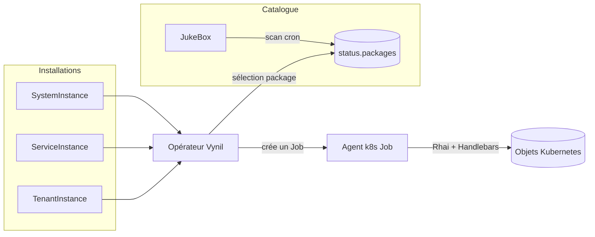

# Vynil — gestionnaire de paquets pour Kubernetes

> Vynil est à Kubernetes ce que `dpkg`/`rpm` sont à une distribution Linux : un
> gestionnaire de paquets dont le but est de produire une **distribution Kubernetes
> intégrée**, et non d'offrir une flexibilité de déploiement maximale.

## En une phrase

Vous décrivez une **source de paquets** (`JukeBox`) et des **installations**
(`SystemInstance`, `ServiceInstance`, `TenantInstance`) sous forme de ressources
Kubernetes ; l'opérateur Vynil réconcilie ces objets en lançant un **agent** dans des
Jobs qui déploient, mettent à jour, sauvegardent et désinstallent les applications.

## Objectif primaire et positionnement

Contrairement à Helm, Kustomize, ArgoCD ou Flux — qui donnent toute latitude pour
installer comme bon vous semble — Vynil vise **l'intégration par défaut**. La
personnalisation y est volontairement réduite, mais tout s'intègre nativement avec le
reste de la distribution. Vynil se distingue aussi d'OLM (OpenShift) : OLM n'installe que
des opérateurs, alors que Vynil est un opérateur d'installation *générique*. Il peut
installer une application simple (phpMyAdmin), une application avec état et sauvegarde
(une base de données) ou un composant cluster unique (kube-virt) sans exiger un opérateur
dédié par application.

## Le modèle mental en trois objets

| Objet | Portée | Rôle |
|---|---|---|
| **JukeBox** | cluster | Source de paquets. Scanne périodiquement un registre OCI (ou un cache HTTP/S3) et publie la liste des paquets disponibles dans son `status`. |
| **SystemInstance** | namespace | Installe un paquet *système* (composant cluster, sans sauvegarde). |
| **ServiceInstance** | namespace | Installe un paquet *service* (application partagée, avec CRDs propres et sauvegarde). |
| **TenantInstance** | namespace | Installe un paquet *tenant* (application cantonnée à un tenant, avec sauvegarde/restauration). |

Un **paquet** est une **image OCI** : ses métadonnées sont portées par des annotations
OCI, et son contenu embarque des templates Handlebars et des scripts Rhai décrivant son
cycle de vie.

## Par où commencer

- **Découvrir le modèle** → [Concepts](concepts.md)
- **Installer Vynil** → [Installation](installation.md)
- **Comprendre le moteur** → [Architecture](architecture.md) et [Réconciliation](reconciliation.md)
- **Écrire un paquet** → [Format d'un paquet](packages/format.md), [Cycle de vie](packages/lifecycle.md), [Génération](gen-package.md)
- **Publier des paquets** → [Sources de JukeBox](jukebox/sources.md), [Build & signature](build-signing.md), [Maintenance du registre](jukebox/registry-maintenance.md)
- **Outiller** → [Référence CLI de l'agent](cli.md), [Lint](tooling/lint.md), [Tests de paquet](tooling/test.md)
- **Exploiter** → [Sécurité & modèle de menace](operations/security.md), [Dépannage](operations/troubleshooting.md), [Référence](operations/reference.md)

## Note pour les assistants (LLM)

Un index lisible par machine est disponible à la racine du dépôt :
[`llms.txt`](../llms.txt). Il liste les pages de cette documentation avec une courte
description, au format [llmstxt.org](https://llmstxt.org). Toutes les pages sont du
Markdown brut, directement consommable.

## Licence, état et crédits

BSD-3-Clause. Projet en développement actif (workspace en version `0.7.7`). Fork :
`sebt3/vynil`.

Documentation rédigée et maintenue par les mainteneurs, à partir du code et du
retour d'expérience d'exploitation de distributions Vynil en production.
