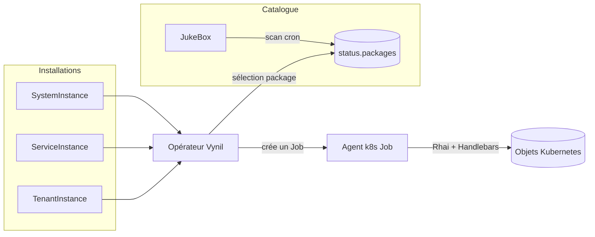

# Vynil — package manager for Kubernetes

> Vynil is to Kubernetes what `dpkg`/`rpm` are to a Linux distribution: a
> package manager whose goal is to produce an **integrated Kubernetes distribution**,
> not to offer maximum deployment flexibility.

## In one sentence

You describe a **package source** (`JukeBox`) and **installations**
(`SystemInstance`, `ServiceInstance`, `TenantInstance`) as Kubernetes resources;
the Vynil operator reconciles these objects by launching an **agent** in Jobs that
deploy, update, back up, and uninstall applications.

## Primary goal and positioning

Unlike Helm, Kustomize, ArgoCD, or Flux — which give you full latitude to install
however you like — Vynil targets **integration by default**. Customisation is
deliberately limited, but everything integrates natively with the rest of the
distribution. Vynil also differs from OLM (OpenShift): OLM only installs operators,
whereas Vynil is a *generic* installation operator. It can install a simple
application (phpMyAdmin), a stateful application with backups (a database), or a
unique cluster component (kube-virt) without requiring a dedicated operator per
application.

The value proposition is **opinionation**: a Vynil package locks in integration
decisions (resources, storage, networking, security, dependencies) that a generic
chart leaves to each user — see
[Building a distribution](distribution.md). The package format = OCI image delivers
the rest: immutability, auditability, air-gap —
see [The OCI package](packages/portability.md).

## Use cases

Vynil is a generic framework: the same engine covers very different use cases.

| Use case | In brief |
|---|---|
| **Community distribution** | Reproducing the ecosystem of a Linux distribution (Debian-style) in Kubernetes: an integrated catalogue maintained by a community. |
| **Enterprise distribution** | An internal platform integrated with the existing ecosystem (SSO, storage, networking, compliance); teams consume pre-integrated packages. |
| **SaaS orchestration** | The customer orders their tenant and options in the product UI; the product creates `TenantInstance` objects and Vynil deploys and maintains them. The product itself can be distributed as a Vynil package. |
| **Cloud infrastructure orchestration** | The OpenTofu phase of packages drives out-of-cluster resources (DNS, buckets, managed databases…) within the same lifecycle. |
| **Platform-as-a-Service from Kubernetes** | Defining a self-service platform (in the spirit of Crossplane, without its CRD proliferation): capabilities are packages, user-facing surfaces are instances. |
| **Upstream packaging** | An open-source project publishes its own box directly — the project's "official package", signed upstream, consumed via a simple additional JukeBox. |

## The mental model in three objects

| Object | Scope | Role |
|---|---|---|
| **JukeBox** | cluster | Package source. Periodically scans an OCI registry (or an HTTP/S3 cache) and publishes the list of available packages in its `status`. |
| **SystemInstance** | namespace | Installs a *system* package (cluster component, no backup). |
| **ServiceInstance** | namespace | Installs a *service* package (shared application, with its own CRDs and backup). |
| **TenantInstance** | namespace | Installs a *tenant* package (application scoped to a tenant, with backup/restore). |

A **package** is an **OCI image**: its metadata is carried by OCI annotations, and
its content embeds Handlebars templates and Rhai scripts describing its lifecycle.

## Getting started

- **Discover the model** → [Concepts](concepts.md)
- **Install Vynil** → [Installation](installation.md)
- **Understand the engine** → [Architecture](architecture.md) and [Reconciliation](reconciliation.md)
- **Build a distribution** → [Distribution](distribution.md), [The OCI package](packages/portability.md)
- **Write a package** → [Package format](packages/format.md), [Lifecycle](packages/lifecycle.md), [Generation](gen-package.md)
- **Publish packages** → [JukeBox sources](jukebox/sources.md), [Build & signing](build-signing.md), [Registry maintenance](jukebox/registry-maintenance.md)
- **Tooling** → [Agent CLI reference](cli.md), [Lint](tooling/lint.md), [Package tests](tooling/test.md)
- **Operations** → [Security & threat model](operations/security.md), [Troubleshooting](operations/troubleshooting.md), [Reference](operations/reference.md)

## Note for AI assistants (LLM)

A machine-readable index is available at the root of the repository:
[`llms.txt`](../llms.txt). It lists the pages of this documentation with a short
description, in [llmstxt.org](https://llmstxt.org) format. All pages are raw
Markdown, directly consumable.

## License, status, and credits

BSD-3-Clause. Project under active development (workspace version `0.7.7`). Fork:
`sebt3/vynil`.

Documentation written and maintained by the maintainers, based on the code and
operational experience from running Vynil distributions in production.
