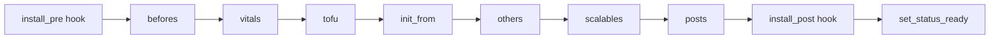
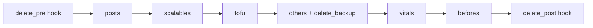

# Package Lifecycle

The agent runs Rhai scripts for each operation (`install`, `delete`, `reconfigure`,
`backup`, `restore`). This page describes the orchestration, the phases, and the
extension points. The reference scripts are in
[`agent/scripts/{system,service,tenant}/`](../../../agent/scripts/).

## General orchestration

Each operation has an orchestrator script (`install.rhai`, `delete.rhai`, …) that:

1. runs an optional `<op>_pre` hook;
2. processes each **phase** that is present (based on whether the corresponding directory exists);
3. reloads the instance from the API between phases (to see updated statuses);
4. runs an optional `<op>_post` hook;
5. updates the final status (`set_status_ready`).

The `import_run(name, …)` mechanism imports and runs `name::run(...)` if it exists,
and silently ignores missing modules/functions — this is what makes phases and hooks
optional.

## Installation phases

Application order (tenant — `agent/scripts/tenant/install.rhai`):

| # | Phase | Directory | Typical content | Status updated |
|---|---|---|---|---|
| 1 | befores | `befores/` | init jobs, prerequisite secrets | `status.befores` |
| 2 | vitals | `vitals/` | PVC, persistent data | `status.vitals` |
| 3 | tofu | `tofu/` | OpenTofu/Terraform resources | `status.tfstate` |
| — | init_from | — | restore if first install + `initFrom` | — |
| 4 | others | `others/` | Service, ConfigMap, Ingress, Role… | `status.others` |
| 5 | scalables | `scalables/` | Deployment, StatefulSet… | `status.scalables` |
| 6 | posts | `posts/` | final actions | `status.posts` |
| — | backup | — | `schedule_backup` or `delete_backup` | — |

After the phases, if the instance has `vitals` and backup is enabled (`use_backup`)
and a `backup-settings` secret exists, a `schedule_backup` is set; otherwise any
existing backup is removed.

## Uninstallation phases

`delete.rhai` proceeds in **reverse order** and relies on the `status` lists
(not the package content) to determine what to remove:

Each sub-script (`delete_others`, `delete_vitals`, …) iterates over `instance.status.<phase>`,
retrieves each object via `k8s_resource(...)`, deletes it, and waits for it to disappear
(`wait_deleted`, 5 min timeout). `NotFound` errors are tolerated.

> The `status` is the source of truth for *what was directly created*: even if the package
> content changes, the uninstallation knows what to destroy as long as the `status` is
> available. However, the `status` alone is **not** sufficient to guarantee a complete
> cleanup: the package's `delete_*` hooks (see below) remove resources created
> *indirectly* — typically by a third-party operator driven by the package — that do not
> carry the instance's ownership markers. A delete without the package image (and therefore
> without its hooks) is inherently *best-effort* and may leave residual resources.
> See the tenant→service limitation in [Troubleshooting](../operations/troubleshooting.md).

## Extension points (hooks)

For each phase and each operation, `*_pre`/`*_post` hooks can be provided by
the package in `scripts/`:

- `install_pre.rhai`, `install_post.rhai`
- `install_befores_pre.rhai`, `install_befores_post.rhai`, … (likewise for vitals/others/scalables/posts)
- `install_<phase>_add.rhai` — adds objects to a phase in addition to the templates
- `delete_pre.rhai`, `delete_post.rhai`, and the `delete_<phase>_pre/post` variants
- `context_extra.rhai` — enriches the context with **derived** values before any
  rendering (the result is exposed under `context.extra`)
- `context.rhai` / `context_tenant.rhai` / `context_service.rhai` — build the execution
  context (variables available to templates and scripts)

A hook receives `(instance, context[, args])` and can return a `map` to enrich the
`context` returned to subsequent phases.

### Proven hook patterns

Some recurring patterns observed in production packages:

- **`context_extra.rhai` as the sole computation point**: replica count derived from the
  namespace HA mode, storage class selection, conditional feature activation based on the
  presence of a CRD (`context.cluster.crds.contains(...)`), discovery of services provided
  by other packages (`resolv_service`). Templates remain purely declarative.
- **`delete_vitals_pre.rhai` to prepare for destruction**: for example, switching a
  replicated database back to single-replica mode (by patching the third-party operator
  resource) before destroying the volumes, to avoid quorum deadlocks.
- **`delete_vitals_post.rhai` to purge indirect resources**: explicitly deleting PVCs
  created by a StatefulSet or a third-party operator (which do not belong to the instance
  in terms of Vynil ownership markers), then waiting for them to disappear (`wait_deleted`).
  Without this hook, an uninstallation would leave these volumes orphaned.
- **`install_<phase>_add.rhai` for non-templatizable objects**: objects whose list depends
  on an option (one PVC per element of a list, for example).

These patterns show why the package image is required for deletion: only its hooks know
how to undo what the installation caused indirectly.

## Other operations

| Operation | Script | Role |
|---|---|---|
| `reconfigure` | `reconfigure.rhai` | Recomputes and reapplies without reinstalling everything (following an options change). |
| `backup` | `backup.rhai` + `backup_run.rhai` + `backup_prepare_*` | Restic backup of vitals (PostgreSQL, MySQL, MongoDB, Redis, secrets). |
| `restore` | `restore.rhai` + `restore_run.rhai` + `restore_*` | Restore from a snapshot. |
| `maintenance_start` / `maintenance_stop` | — | Puts the application on pause (scale down) for data operations. |

## Reusable library

`agent/scripts/lib/` provides shared functions:

- `gen_package.rhai` — template generation (see [Generation](../gen-package.md))
- `secret_dockerconfigjson.rhai` — reading imagePull secrets
- `scan_harbor.rhai` — listing Harbor repositories
- `backup_context.rhai`, `wait.rhai`, `storage_class.rhai`, `resolv_service.rhai`,
  `install_from_dir.rhai`, `tofu_gen.rhai`, …

These functions are covered by regression tests (see [Package tests](../tooling/test.md)
and the `agent/tests/rhai_*.rs` suite).
