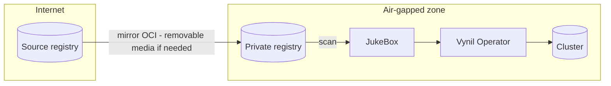

# OCI Package — immutability, auditability, air-gap

A Vynil package is an **OCI image**: this format choice is not an implementation detail,
it is what makes the model usable both by a small team without a dedicated platform
team and by an enterprise with its audit teams and disaster recovery plan.

## Immutability

A published version no longer changes: semver tag + content digest. The Cosign signature
([Build & signing](../build-signing.md)) seals this digest — what was reviewed and signed
is exactly what will be installed. Update policies rely on immutable versions and explicit
migration waypoints, not on a moving `latest` tag.

## Auditability

A package's content is **fully readable**: `agent package unpack` restores the
`package.yaml`, the Handlebars templates, and the Rhai scripts — that is, the exact and
complete recipe of what will be applied to the cluster. No black box, no opaque binary.

Practical implications:

- an audit team can **freeze a version, review it, and approve it**; the signed digest
  guarantees that this exact version is what runs;
- the diff between two versions is a **text-file diff**;
- the SBOM published at build time feeds continuous vulnerability analysis;
- the [threat model](../operations/security.md) then reduces to an explicit trust decision:
  *which boxes, signed by which keys?*

## Outsourceable development

A package directory is a **self-contained deliverable**: it can be developed, linted,
tested, and rendered (`agent package test`, K8s mocks — no cluster required) outside of
any infrastructure. Its development can therefore be entrusted to a third party:

1. the vendor delivers the package directory (or a MR on the box);
2. the internal review reads the recipe — templates and scripts, in plain text;
3. **your** CI builds, signs, and publishes — the signing key never leaves your perimeter.

The trust boundary is clear: the vendor writes, you sign.

## Air-gapped by design

Since a package is a standard OCI image, it can be moved with standard OCI tooling
(`skopeo`, `crane`, registry mirrors…). An internet-isolated environment consumes the
mirrored distribution:

- the JukeBox scans the private registry — **no internet dependency at install time**;
- `http`/`s3` sources ([Sources](../jukebox/sources.md)) even allow serving a
  pre-computed index from a simple internal file server;
- signatures travel with the images: verification remains possible offline.

## Reconstruction and disaster recovery

A Vynil platform is described by two artifacts: **the box** (the packages, in a registry)
and **the instance manifests** (JukeBox + `*Instance`, typically version-controlled in
GitOps). Post-disaster reconstruction follows:

1. restore/mirror the package registry;
2. re-apply the instance manifests;
3. the operator reconciles — bootstrap, tenants, applications;
4. restore data from backups (`initFrom`).

The DR plan is not a separate document: it is the distribution itself, replayable and
testable.

## Who is it for?

| | What the format brings |
|---|---|
| **Small team** | Opinionated and safe defaults, zero configuration time, updates via waypoint chains — without a dedicated platform team. |
| **Enterprise** | Full content auditability, signature and SBOM for compliance, outsourceable development without surrendering the signing key, native air-gap, reconstructible and testable DR. |
