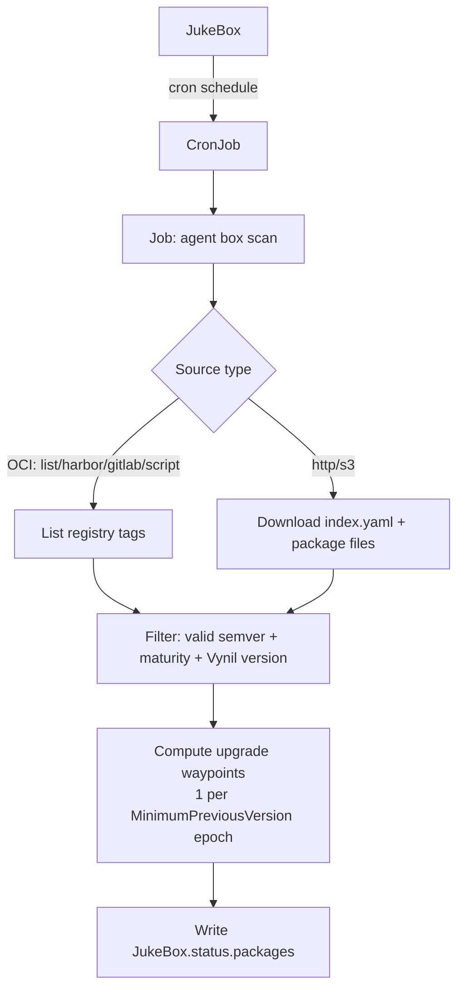
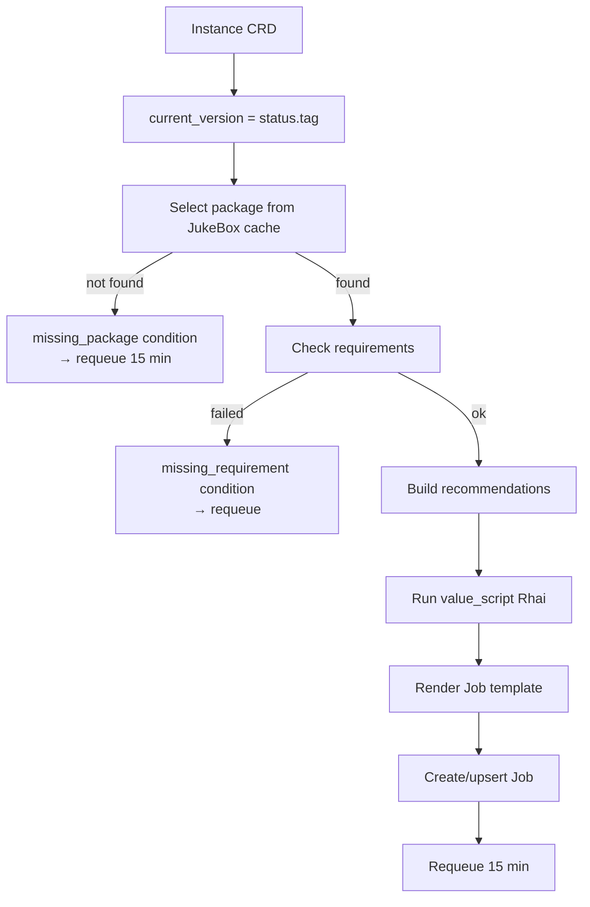
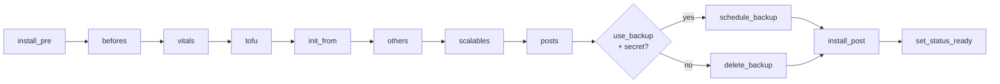
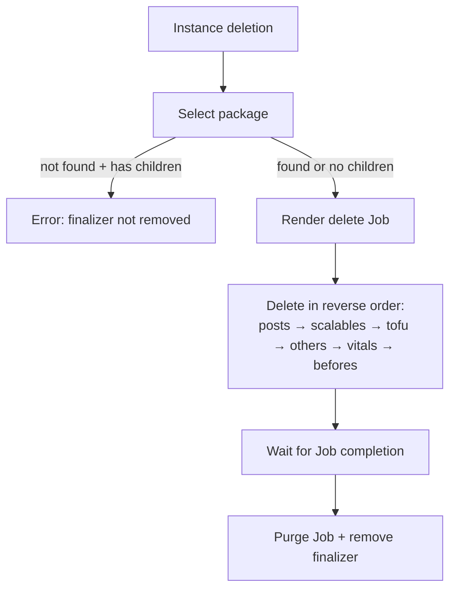

# Reconciliation & lifecycle

This page describes what the operator does (the "what") and what the agent does (the
"how"). The generic instance reconciliation code lives in
[`operator/src/instance_common.rs`](../../operator/src/instance_common.rs) via the
`InstanceKind` trait, shared by all three instance types.

## JukeBox scan

The operator ([`operator/src/jukebox.rs`](../../operator/src/jukebox.rs)) maintains the
CronJob, detects scan Job completion (condition `Complete`/`Failed`), and only reloads the
cache **once per completion** (tracked via the `last-scan-time` annotation).

### Standalone scan (`box file-scan`)

```mermaid
flowchart LR
    SPEC[Local JukeBox YAML spec] --> FS[agent box file-scan]
    FS --> OCI2[Scan OCI registries\nno K8s connection required]
    OCI2 --> WP2[Compute waypoints\nfor all 3 maturity levels]
    WP2 --> IDX["Produce index.yaml\n+ category_name.yaml"]
    IDX -->|optional upload| CACHE2[(HTTP/S3 cache)]
    CACHE2 --> JB2[JukeBox source http/s3]
    JB2 --> F2[Apply maturity filter\n+ recompute waypoints]
    F2 --> ST2[Update status.packages]
```

## Instance reconciliation (apply)

`do_reconcile<T>()`:

1. `current_version = status.tag` (empty on first install).
2. **Package selection** from the JukeBox cache:
   - `name` + `category` + `usage == instance type`,
   - `is_min_version_ok(current_version)` — upgrade chain respected,
   - `is_vynil_version_ok()` — framework compatible.
   - If not found → `missing_package` condition and requeue (15 min).
3. **Requirements** (`check_requirements`): CRDs, system services, resources… Failure →
   `missing_requirement` condition and requeue.
4. **Recommendations**: optional lists (present CRDs, available system/tenant services)
   injected into the context.
5. **value_script** Rhai (if present) → control variables (`ctrl_values`).
6. **initFrom.version** (first install) → verification that the tag exists (cache then OCI).
7. **Job rendering** via `operator/templates/package.yaml.hbs` (action `install`).
8. **Job creation/upsert** (Server-Side Apply, fallback delete+create).
9. Requeue every **15 minutes**.

The `force-reinstall` annotation deletes the existing Job before recreation. The
`suspend=true` annotation short-circuits everything at step (1).

## Installation phases (agent side)

Once the Job is launched, the agent unpacks the image and executes the lifecycle script
(`agent/scripts/{type}/install.rhai`). Objects are applied **by phase**, and the instance
is reloaded between each phase to propagate status updates:

See [Package lifecycle](packages/lifecycle.md) for details on `*_pre`/`*_post` hooks and
the semantics of each phase.

## Deletion (finalizer / cleanup)

`do_cleanup<T>()`:

1. Package selection (same filter as install).
2. If the package cannot be found **and** the instance has children
   (`status.have_child()`), an error is raised (the finalizer is not removed as long as the
   package is missing).
3. Otherwise: Job rendered with action `delete`, executing `delete.rhai` which removes
   children **in reverse order** (posts → scalables → tofu → others → vitals → befores),
   based on the `status` lists.
4. Wait for the delete Job to complete, purge the Job, remove the finalizer.

> **Known limitations** (see [Troubleshooting](operations/troubleshooting.md)):
> - If the package `type` has changed since installation (e.g. `tenant` → `service`),
>   selection fails and deletion remains blocked (issue #12).
> - Completion waiting does not detect the `Failed` state: a failing delete Job waits
>   until the timeout (issue #15).

## Error handling and requeue

Each controller has an `error_policy` that logs the error, increments failure metrics, and
requeues (5 min for JukeBox). Successful reconciliations requeue at 15 min. Blocking
operations (waiting for Job deletion/completion) have explicit timeouts (20 s for a
deletion, 10 min for a delete Job).

## Metrics

The operator exposes Prometheus metrics on `GET /metrics` (port 9000). Four registries
(one per resource type) expose: reconciliation duration (histogram), success/failure
counters, in-progress reconciliation gauge, last event timestamp.
